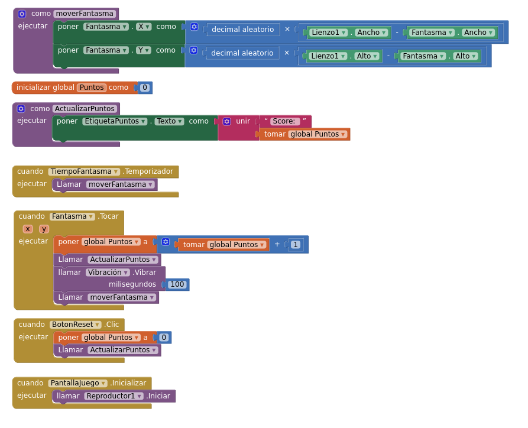

## Empezando a trabajar con AppInventor

Esto son sólo unas indicaciones para empezar a crear aplicaciones con AppInventor. No están todos los detalles, pero quizás haya suficiente para empezar...

Necesitaremos un móvil y un ordenador con un navegador web (Firefox, Chrome, etc.).

### Instalación en el móvil

* Asegúrate que tu móvil está conectado a la red Wifi, y que es la misma red a la que está conectado el ordenador.

* Busca la aplicación MIT AppInventor en el Play Store (Android) o App Store (iOS) de tu móvil.

* Instálala

### Instalación en el ordenador

Fácil: no hay nada que instalar, vamos a trabajar en el navegador

###  Creación de mi primera aplicación

En el ordenador:

* Carga en tu navegador la página inicial del [AppInventor](http://appinventor.mit.edu).

* Pulsa en [Create Apps](https://ai2.appinventor.mit.edu/). Tendrás que autenticarte con una cuenta en Google.

* Lo que ves ahora es el diseñador de aplicaciones. Explóralo.

* Pulsa en "Conectar", y en el menú que se despliega, pulsa "AI Companion". Verás que se muestra un código QR en pantalla.

En el móvil:

* Lanza la aplicación MIT AppInventor (una vez estás en el navegador del ordenador en el diseñador, y has pulsado en "Conectar".

* Verás un menú. Pulsa la opción "scan QR code".

* Escanea el código QR que salió en la pantalla del ordenador.

* Deberías ver la aplicación que tengas en el diseñador en tu móvil.

A partir de ahora, los cambios que vayas haciendo en el diseñador se irán reflejando en la aplicación que ves en tu móvil.

## Cómo instalar las aplicaciones en Android

Primero: ¿por qué sólo en Android, y no en iOS? En Android el usuario del teléfono puede decidir instalar aplicaciones que no provengan de la tienda oficial de aplicaciones (Google Play), mientras que en general, en dispositivos iOS, no se pueden instalar aplicaciones que no vengan de la tienda oficial (App Store).

Segundo: ¿cómo las instalo en Android? Si ya tenemos el archivo apk, o un enlace a él (por ejemplo, el QR que genera AppInventor) podemos seguir estos pasos:

* Acceder a la configuración (Ajustes) del teléfono Android.
* Si el teléfono tiene la opción de "Buscar" en Ajustes, intentaremos las palabras clave: "instalar", "fuentes", "desconocidas", "aplicaciones"...
* En caso contrario, accederemos al apartado de Aplicaciones/Seguridad.
* Buscaremos algo parecido a "Fuentes de Instalación".
* Si lo encontramos, habilitaremos la instalación desde "Chrome" (si usáis otro buscador por defecto, habilitar ese. Ej.: Firefox)
* Si nada de esto funciona, intenta instalar la aplicación de AppInventor, y el teléfono (normalmente) te dará una serie de pasos para habilitar la instalación de fuentes desconocidas.

## Ejemplos de aplicaciones

Veamos algunos ejemplos de aplicaciones, para empezar a jugar con AppInventor.

[SmashTheGhost](https://gallery.appinventor.mit.edu/?galleryid=417506fe-1d83-4fb6-b96c-8923d78ff4b8)

* [Recursos necesarios](https://drive.google.com/drive/folders/1QzApJ88YJDxLtc
AzFsboUAtVvZXR9Dur?usp=sharing)
* [Videotutorial](https://www.youtube.com/watch?v=w9pY619xAVU&ab_channel=ObsidianSoft)

* Más videotutoriales que nos pueden ayudar con esta aplicación.

  * [Cómo hacer un juego para Android](https://www.youtube.com/watch?v=r5BSdrJ67sw&list=PLpUc6p7LC8LPcj7f1Zw3-oolB1ArjdST3&index=3&ab_channel=InventorsApp)
  

[TicTacToe](https://gallery.appinventor.mit.edu/?galleryid=ef0a934b-916a-482b-9eaf-d01786cdbd07)

## Hagamos la aplicación SmashTheGhost

Ahora vamos a hacer la aplicación que estudiamos antes.

### Primera pantalla: diseño

* Habilitamos la instalación de fuentes desconocidas (seguir tutorial)
* Probamos la demo de la aplicación (quien pueda)
* Descargamos los archivos de google drive
* Eliminamos statusbar y titlevisible de Screen1
* Subimos todos los archivos del enlace de google drive (uno a uno)
* Ponemos "Color de fondo" (está debajo de DispVertical) a negro
* Poner una disp. vertical: centro/centro, ajustar al contenedor hor/vert, color black
* Añadimos una imagen en la disp. vertical: usamos "splashcreen.png" (71px alto, 270px ancho)
* Añadimos una Etiqueta con: "Tienes 30 segundos", tamaño 25 color rojo. (EASTER EGG)
* Añadimos un sensor nuevo: el reloj, lo ponemos a 2000ms, es decir, 2segundos.
*  Nos conectamos y vemos la aplicacióm, de momento.

### Primera pantalla: bloques

* "Cuando reloj1 ejecutar": reloj
* Cada dos segundos --> podemos hacer cosas, solo queremos hacer UNA sola cosa, por lo que ponemos nuestro timer a false: reloj
* "Abrir otra pantalla": control
* Crear otra pantalla "PantallaJuego" y automáticamente vamos a diseñarla.

### Segunda pantalla: diseño
 
* Eliminamos statusbar y titlevisible de "PantallaJuego": color de fondo negro
* Añadimos un lienzo: color fondo negro, 80% ALTO y ajustamos el contenedor ANCHO
* Añadimos una disp. horizontal abajo: color negro, centro/centro, ajustar a TODO el contenedor
* Dentro de la disp. horizontal: etiqueta de texto (cambio nombre, "Puntos: --", blanco, letra 25) y botón (cambio nombre, "reset", redondeado, letra 25, color fondo blanco)
* Separamos los 2 componentes con una disp. horizontal
* Componente de SONIDO: "vibracion"
* Añadimos un RELOJ: "TiempoFantasma"
* Añadir una SPRITE IMAGE (imagen que se mueve): "Fantasma", le añadimos la imagen (50px, 50px)
* Añadimos un REPRODUCTOR: añadimos la canción (marcamos las 2 OPCIONES)

### Segunda pantalla: bloques

* Hacemos un procedimiento: "MoverFantasma" ¿Que será?

### Tercera pantalla

Probad a hacer también una tercera pantalla, con el segundo temporizador que hemos creado, para que acabe la partida y la muestre.

## Hagamos la aplicación TicTacToe

* El programa contiene 3 grandes bloques en los que se hacen las mayorías de cosas
* Nos fijamos en la primera orden de cada grande bloque: ¿Qué podrían hacer?
* Tenemos el primer bloque: "ponerBonitoyReiniciarJuego"
* Segundo bloque: "cuando pulso cualquier botón --> ejecutar algo"
* Tercer bloque: "comprobarGanador --> ejecutar algo"
* Efectivamente, en estos tres sencillos pasos, se basa nuestra aplicación:

  * Coloca los botones en su sitio y reinicia el juego.
  * Cuando pulso un botón, le pone una "X" o una "O" dependiendo del jugador.
  * Cada vez que pulso un botón, se comprueba si tenemos tres "O" o "X" seguidas, para ver si tenemos un ganador.
  * En la comprobación del ganador también está incluida la funcionalidad del notificador (se muestra un mensaje en pantalla dependiendo de la situación).

## Créditos

Prácticamente todo el contenido de esta página ha sido preparado por Carlos Nebril Jiménez. ¡Muchsa gracias!
