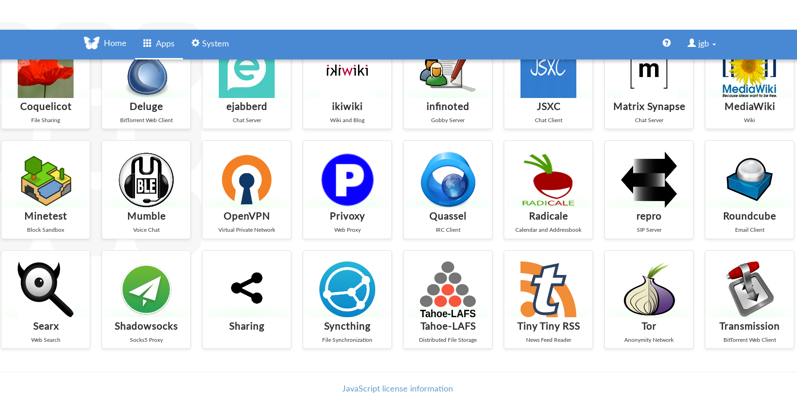

# Installing and managing Freedom Box

I had a spare Raspberry Pi 3 Model B, and I decided to give it a try with the software produced by the [FreedomBox project](https://freedombox.org/). I want to check to which extent it could be used for hosting services that most people use "from the cloud".

My complete environment is:

* Home network, with a simple WiFi and Ethernet capable router. I connect my Raspberry Pi to it, via Ethernet.
* Raspberry Pi Model B, for running FreedomBox.
* Debian box, for preparing stuff, and initial connection to the FreedomBox. It runs Debian/testing.

## Installation

Once nice thing about Raspberry Pi is that it boots from a SD card. All you need to do to test a new system is to produce an new SD card that boots it, and insert it in the device. Once I found out which image I had to use for producing a boot Raspberry Pi SD card, the process was absurdly easy.

Raspberry Pi 3 is not a device supported by FreedomBox stable, apparently because it needs some proprietary software for booting (at least when using Ethernet). But you can find [an entry about it](https://wiki.debian.org/FreedomBox/Hardware/RaspberryPi3) in the [FreedomBox wiki](https://wiki.debian.org/FreedomBox/). In that entry, you can find out that bootable images for this device are available only for the [testing distribution downloads](https://freedombox.org/download/testing/) (and not for the stable one). The image I used was [freedombox-testing-nonfree_latest_raspberry3-armhf.img.xz](https://ftp.freedombox.org/pub/freedombox/testing-latest/freedombox-testing-nonfree_latest_raspberry3-armhf.img.xz).

For producing the SD card, I followed the instructions in [Downloading images](https://wiki.debian.org/FreedomBox/Download#Downloading_Images), running the checks on the integrity and signatures of the files and all that. Then, I uncompressed the downloaded image, and copied it to the SD card. My card is a 16 GB one, but I guess a 4 GB one would be enough. In my Debian box, I run:

```bash
$ xz -d freedombox-testing-nonfree_latest_raspberry3-armhf.img.xz
$ sudo dd bs=1M if=freedombox-testing-nonfree_latest_raspberry3-armhf.img of=/dev/mmcblk0 conv=fdatasync
$ sudo sync
```

My SD card in Debian was mounted as `/dev/mmcblk0`. I guess the third line is not really needed, since `dd` is already syncing, but just in case.

Then, I just removed the SD card from my Debian box, inserted it in the Raspberry Pi, connected it to an spare Ethernet port in my home router, powered it, and it started to run! This was all with respect to installation. See below how I learned that it had booted correctly, and how I accessed it.


## Finding and configuring FreedomBox

So I had my brand new FreedomBox up and running, but I still didn't know it. Following [instructions in the How to get Started section in the manual](https://wiki.debian.org/FreedomBox/Manual#FreedomBox.2FManual.2FQuickStart.How_to_get_started), I used mDNS to access the device. For that, I had to install mDNS in my Debian box, following [instructions in the ZeroConf for Debian wiki](https://wiki.debian.org/ZeroConf):

```bash
$ apt-get install avahi-daemon avahi-discover libnss-mdns
```

Once this was done, I just browsed to [http://freedombox.local/](http://freedombox.local/), and I got the FreedomBox welcome message in my browser.

Just to test it, I also used `nmap` to find out the IP address that my router had allocated for the device:

```bash
$ nmap -p 80 --open -sV 192.168.1.0/24
Starting Nmap 7.70 ( https://nmap.org ) at 2018-08-03 22:05 CEST
...
Nmap scan report for 192.168.1.75
Host is up (0.014s latency).

PORT   STATE SERVICE VERSION
80/tcp open  http    Apache httpd 2.4.33
Service Info: Host: 127.0.1.1

Service detection performed. Please report any incorrect results at https://nmap.org/submit/ .
Nmap done: 256 IP addresses (8 hosts up) scanned in 10.26 seconds
```

(some other web servers were found, of other devices in my network, but this is the relevant part).

Now, the configuration is just following instructions in the browser. I need to provide a user and password, and that's all. Pretty simple. Now I'm ready to install apps in my FreedomBox!



## Adding firmware for brcm

When looking at dmsg, I see an error which seems to be related to the Broadcom 802.11 wireless card. Nothing that important, since I'm not using it, but just in case...

The error I saw was:

```bash
$ sudo dmesg
[   11.131774] usbcore: registered new interface driver brcmfmac
[   11.132290] brcmfmac mmc1:0001:1: firmware: failed to load brcm/brcmfmac43430-sdio.bin (-2)
[   11.132719] firmware_class: See https://wiki.debian.org/Firmware for information about missing firmware
[   11.133208] brcmfmac mmc1:0001:1: Direct firmware load for brcm/brcmfmac43430-sdio.bin failed with error -2
```

I fix it by installing the corresponding (non-free) package:

```bash
sudo apt-get install firmware-brcm80211
Reading package lists... Done
Building dependency tree       
Reading state information... Done
The following NEW packages will be installed:
  firmware-brcm80211
0 upgraded, 1 newly installed, 0 to remove and 12 not upgraded.
Need to get 4,247 kB of archives.
After this operation, 15.5 MB of additional disk space will be used.
Get:1 http://deb.debian.org/debian testing/non-free armhf firmware-brcm80211 all 20180518-1 [4,247 kB]
Fetched 4,247 kB in 1s (8,326 kB/s)          
Selecting previously unselected package firmware-brcm80211.
(Reading database ... 49490 files and directories currently installed.)
Preparing to unpack .../firmware-brcm80211_20180518-1_all.deb ...
Unpacking firmware-brcm80211 (20180518-1) ...
Setting up firmware-brcm80211 (20180518-1) ...
```

## Problems with temperature

My Raspberry Pi was shutting down for apparently no reason from time to time. At first, it seemed to be linked to Syncthing doing its stuff, but after a while, I read in /var/log/syslog, and I found the reason:

```
Aug  4 18:56:07 freedombox kernel: [17713.777695] thermal thermal_zone0: critical temperature reached (81 C), shutting down
```

So, the problem is the CPU gets too hot. Maybe linked to Syncthing activity (it seems it uses the CPU pretty hard), but the real problem is thermal. So, I removed the top of the case, and tried with putting the device in a different, hopefully cooler, location. With 40 C outside, about 32 C at home, that's not easy, though... Let's see if that works.

I'm also learned to monitor temperature:

```bash
$ cat /sys/class/thermal/thermal_zone*/temp
56920
```

Temperature is in millicelsius.

To test it over time (every 5 sec. in this case):

```bash
$ while sleep 5; do cat /sys/class/thermal/thermal_zone*/temp; done
```

## Installing a USB SSD

I have a SSD with a USB connector. I'm going to install it to extend
the storage available in my Raspberry Pi. The process is simple.

First of all, I connect the disk, to know its id:

```
$ sudo blkid
```

The relevant field is `UUID`. I used it for a new entry in `/etc/fstab`:

```
UUID="xxx-63a7d4414402" /media/data-jgbarah auto rw,user,auto 0 0
```

This is all you need...

## Using rsync for backing up my laptop

I decided to use rsync for backing up my laptip in the Raspberry Pi with Freedom Box installed. This was easy...

In the Raspberry Pi, I copy my ssh public key to the `/root` directory
(well, in fact I copied all the `.ssh` directory), and installed `rsync`:

```
$ cd
$ sudo cp -r .ssh /root
$ sudo apt-get install rsync
```

Then, in the laptop I can run rsync as (for example):

```
$ rsync -va --one-file-system --info=progress2,stats2 --delete \
  /home root@freedombox.local:/media/backups
```

## Some useful links

* [FreedomBox project](https://freedombox.org/)
* [FreedomBox wiki](https://wiki.debian.org/FreedomBox/)
* [FreedomBox manual](https://wiki.debian.org/)